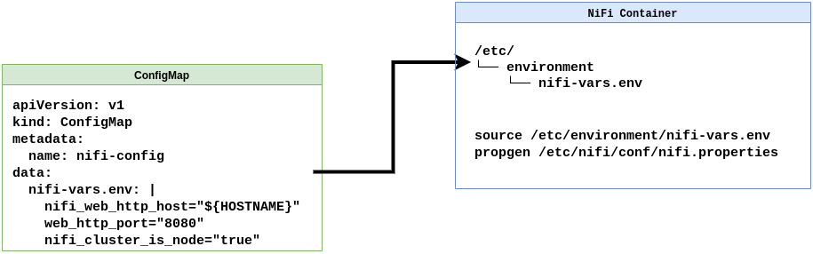

# Big Data Ecosystem Properties Generator
Properties File Generator for using in Big Data Kubernetes Deployments. This tool is for
using along the configuration pattern: 
```
Environment Variables File Mounted as ConfigMap + Properties Generator
```



```
$ ./propgen 
Usage: propgen [flags] 
Flags:
  -file string
        /path/to/filename
  -label string
        NIFI
        HADOOP
        ZOOKEEPER
        KUDU
        IMPALA
  -render string
        coresite
        hdfssite
        nifiproperties
        zoocfg
        kudumaster
        kuduworker
        impaladaemon
        impalacatalog
        impalastatestore
        impalaadmission
        
Examples:
        propgen -label NIFI -render nifiproperties -file /opt/nifi/conf/nifi.properties
        propgen -label HADOOP -render coresite -file /opt/hadoop/etc/hadoop/conf/core-site.xml
        propgen -label HADOOP -render hdfssite -file /opt/hadoop/etc/hadoop/conf/hdfs-site.xml
        propgen -label ZOOKEEPER -render zoocfg -file /opt/zookeeper/conf/zoo.cfg
        propgen -label KUDU -render kudumaster -file /opt/kudu/conf/master.gflagfile
```
